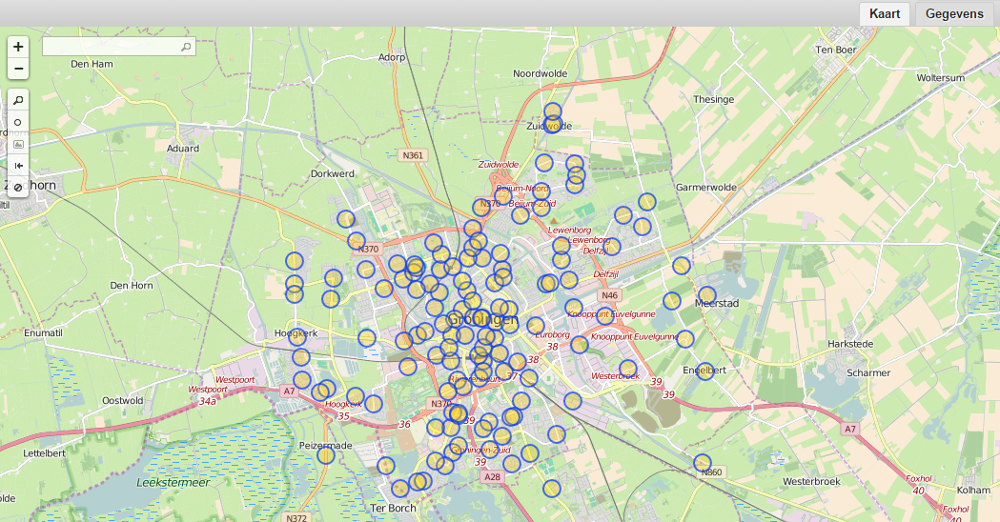
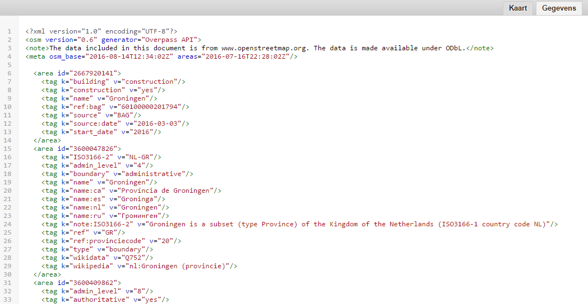

## 2.1 Bounding box filter
We beginnen met een simpel voorbeeld: het opvragen van alle nodes die getagt zijn als brievenbus in de stad Groningen en directe omgeving.
Open [Overpass Turbo](http://overpass-turbo.eu/), voer onderstaande code uit en zoom in op Groningen.  

```
node["amenity"="post_box"](53.178699, 6.46275, 53.2649, 6.66687);
out;
```



Bij het opstellen van een zoekopdracht moet je met het volgende rekening houden:
* Een zoekopdracht bestaat uit acties die na elkaar worden uitgevoerd.
* Acties eindigen met een puntkomma.
* Een filter op basis van een tag definieer je tussen blokhaken.
* Een filter op basis van locatie definieer je tussen ronde haken.
* Een bounding box definieer je als volgt: `(min lat, min lon, max lat, max lon)`

Oefening:  
Maak een zoekopdracht voor het opvragen van alle nodes in de stad Groningen die getagt zijn als [pinautomaat](http://wiki.openstreetmap.org/wiki/Tag:amenity%3Datm).

## 2.2 `{{bbox}}` macro
Als je in Overpass Turbo al bent ingezoomd op het gebied waarvan je de brievenbussen wilt opvragen, kun je volstaan met onderstaande code:

```
node["amenity"="post_box"]({{bbox}});
out;
```

Let op: `{{bbox}}` is een [Turbo Overpass macro](http://wiki.openstreetmap.org/wiki/Overpass_turbo/Extended_Overpass_Turbo_Queries) en werkt niet als je via een andere front end of rechtstreeks de Overpass API bevraagt.


## 2.3 `area` filter
Als je op zoek bent naar brievenbussen in een stad of gemeente, krijg je met een bouding box vaak meer gegevens terug dan je nodig hebt. Eigenlijk kun je beter filteren op stads- of gemeentegrens. Dat kan met een []`area`](http://wiki.openstreetmap.org/wiki/Overpass_API/Areas) filter. `area` is een extra gegevenstype naast node, way en relation, dat alleen binnen Overpass API bestaat. Overpass API kan op verzoek een `area` berekenen, waarna het gebruikt kan worden in een zoekopdracht. 

```
area["name"="Groningen"];
node["amenity"="post_box"](area);
out;
```

Als je bovenstaande code uitvoert en uitzoomt, zie je dat niet alleen de brievenbussen in de stad Groningen, maar in de hele provincie Groningen zijn opgevraagd. Hoe zit dat?
Voer onderstaande code uit en switch in Overpass Turbo naar het tabblad _Gegevens_.

```
area["name"="Groningen"];
out;
```



Je ziet nu dat het `area`-filter een combinatie van vier gebieden oplevert: 
* [een vakantiehuisje op Ameland](http://www.openstreetmap.org/way/267920141#map=16/53.4567/5.7923) met de naam 'Groningen',
* de _provincie_ Groningen,
* de _gemeente_ Groningen en 
* de _stad_ Groningen.

De query filtert dus op een veel groter gebied dan de stad Groningen!
Met behulp van [`admin_level`](http://wiki.openstreetmap.org/wiki/Template:Admin_level_11) kun je aangeven dat je alleen geïnteresseerd bent in de stad Groningen. Door te filteren op `"admin_level"="10"` beperk je de zoekopdracht tot _woonplaatsen_.

```
area["name"="Groningen"]["admin_level"="10"];
node["amenity"="post_box"](area);
out;
```

Oefening:  
Vraag alle brievenbussen op in de provincie Utrecht.

[Volgende](3-filteren-op-tags.md)