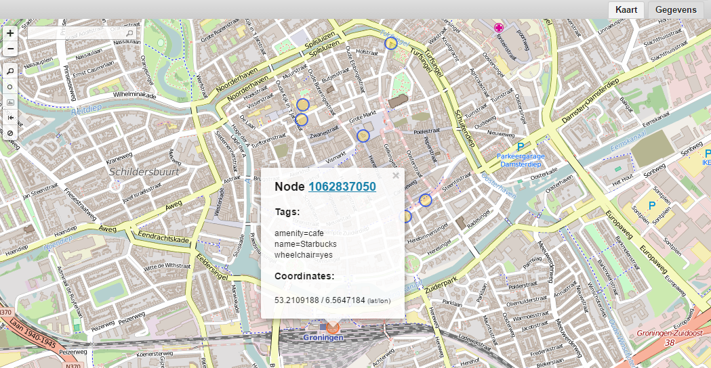
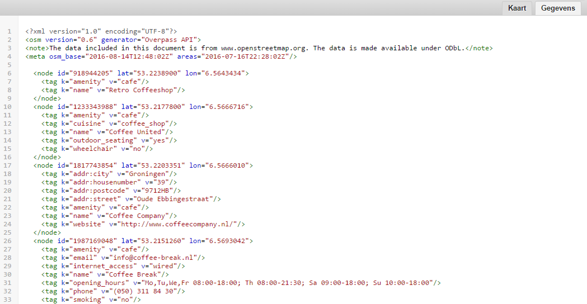
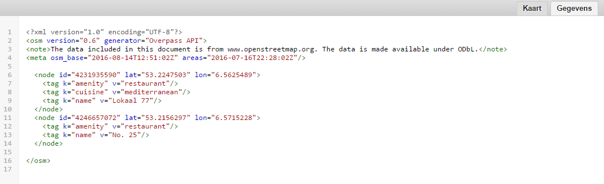

## 3.1 Tag filter
Een tag filter is als volgt gedefinieerd: ```["sleutel"="waarde"]```. In onderstaand voorbeeld worden alle [cafés](http://wiki.openstreetmap.org/wiki/Tag:amenity%3Dcafe) in de stad Groningen opgevraagd.

```
area["name"="Groningen"]["admin_level"="10"];
node["amenity"="cafe"](area);
out;
```

Filteren op twee of meer tags is eenvoudig: je plaatst de tag-filters achter elkaar. Je krijgt als resultaat de elementen die aan alle filtercriteria voldoen. Zo is het bijvoorbeeld eenvoudig om cafés op te vragen die toegankelijk zijn voor [rolstoelgebruikers](http://wiki.openstreetmap.org/wiki/Key:wheelchair).

```		
area["name"="Groningen"]["admin_level"="10"];		
node["amenity"="cafe"]["wheelchair"="yes"](area);		
out;		
```



Je kunt ook filteren op het voorkomen van een tag, ongeacht de waarde. Het tag filter bevat dan alleen de sleutel: ```["sleutel"]```. De volgende zoekopdracht retourneert bijvoorbeeld cafés met een ```wheelchair``` tag, ook de cafés waarvan expliciet is aangegeven dat ze níet toegankelijk zijn voor rolstoelgebruikers.
```
area["name"="Groningen"]["admin_level"="10"];		
node["amenity"="cafe"]["wheelchair"](area);		
out;
```

Oefening:
Vraag alle ING-pinautomaten op in de stad Groningen ([```"amenity"="atm"```](http://wiki.openstreetmap.org/wiki/Tag:amenity%3Datm) en ```"operator"="ING"```).

## 3.2 Reguliere expressies
Je kunt in tag filters ook gebruik maken van [reguliere expressies](https://nl.wikipedia.org/wiki/Reguliere_expressie). In onderstaand voorbeeld worden cafés opgevraagd met in de naam het woord 'Coffee'.

```
area["name"="Groningen"]["admin_level"="10"];
node["amenity"="cafe"]["name"~"Coffee"](area);
out;
```



Het is eenvoudig om je zoekopdracht hoofdletterongevoelig te maken. Onderstaande zoekopdracht retourneert — in tegenstelling tot de vorige — ook het café met de naam 'coffeecompany' (zonder hoofdletter).

```
area["name"="Groningen"]["admin_level"="10"];
node["amenity"="cafe"]["name"~"Coffee",i];
out;
```

Met behulp van een reguliere expressie kun je in één regel filteren op café, bar of restaurant. 

```
area["name"="Groningen"]["admin_level"="10"];
node["amenity"~"cafe|bar|restaurant"](area);
out;
```

Reguliere expressies zijn erg krachtig. Ter illustratie het volgende voorbeeld waarin [restaurants](http://wiki.openstreetmap.org/wiki/Tag:amenity%3Drestaurant) met in de naam een getal tussen 10 en 99 worden opgevraagd.

```
area["name"="Groningen"]["admin_level"="10"];
node["amenity"="restaurant"]["name"~"[0-9]{2}"](area);
out;
```



Je kunt snel controleren of er cafés zijn zonder ```name```-tag.

```
area["name"="Groningen"]["admin_level"="10"];
node["amenity"="cafe"]["name"!~"."](area);
out;
```

Met een reguliere expressie kun je ook controleren of er lege tags zijn. Onderstaande zoekopdracht retourneert alle nodes waarvan de ```name```-tag die leeg is. Gelukkig zijn dat er niet zoveel. Vandaar dat we in dit geval niet filteren op gebied, maar de hele OpenStreetMap-database doorzoeken.

```
node["amenity"="cafe"]["name"~"^$"];
out;
```

Meer informatie over het gebruik van reguliere expressies in combinatie met Overpass API vind je [hier](http://wiki.openstreetmap.org/wiki/Overpass_API/Overpass_QL#Value_matches_regular_expression_.28.7E.2C_.21.7E.29).

Oefening:  
Zoek naar Italiaanse restaurants in Groningen met behulp van een reguliere expressie en de [```cuisine```](http://wiki.openstreetmap.org/wiki/Key:cuisine) tag.

[Volgende](4-verzamelingen.md)