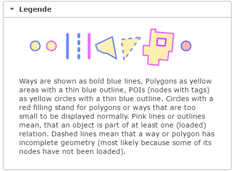

## 4.1 Sets
In Overpass QL werk je met _sets_. Als je niet expliciet een set specificeert, wordt alles gelezen van en weggeschreven naar de standaard set ```_```.
Als je gegevens wilt wegschrijven naar een andere set, gebruik je de ```->``` syntax. 

```
area["name"="Groningen"]["admin_level"="10"] -> .g;
node["amenity"="cafe"](area.g);
out;
```

Wanneer je binnen één zoekopdracht meerdere malen aan dezelfde verzameling gegevens wilt refereren, kan het handig zijn om met sets te werken.

## 4.2 Vereniging
Hoe pak je het aan als je een lijst wilt van alle cafés plus [restaurants](http://wiki.openstreetmap.org/wiki/Tag:amenity%3Drestaurant]) in een gebied? Dan vraag je om een vereniging (of _union_) van twee verzamelingen. Dat doe je met behulp van een [block](http://wiki.openstreetmap.org/wiki/Overpass_API/Overpass_QL#Block_statements)-statement:

```
( 
  area["name"="Groningen"]["admin_level"="10"];  
  node["amenity"="cafe"](area);  
  area["name"="Groningen"]["admin_level"="10"];  
  node["amenity"="restaurant"](area);  
);
out;
```

De herhaling van het `area` filter ziet er lelijk uit, maar is noodzakelijk. Probeer het maar eens uit.  
Om het overzichtelijk te houden, kun je in dit geval beter een set definiëren.

```
area["name"="Groningen"]["admin_level"="10"] -> .g;
( 
  node["amenity"="cafe"](area.g);
  node["amenity"="restaurant"](area.g);
);
out;
```

Hieronder een voorbeeld van een zoekopdracht waarin de cafés in de stad Groningen en Leeuwarden worden opgevraagd.

```
area["name"="Groningen"]["admin_level"="10"] -> .g;
area["name"="Leeuwarden"]["admin_level"="10"] -> .l;
( 
  node["amenity"="cafe"](area.g);
  node["amenity"="cafe"](area.l);
);
out;
```

Tenslotte nog een voorbeeld waarin gebruik wordt gemaakt van de standaard set voor het opvragen van cafés en restaurants in Groningen met een [```opening_hours```](http://wiki.openstreetmap.org/wiki/Key:opening_hours) tag.

```
area["name"="Groningen"]["admin_level"="10"] -> .g;
(
  node["amenity"="cafe"](area.g);
  node["amenity"="restaurant"](area.g);
);
node._["opening_hours"];
out;
```

Als je de laatste regel vervangt door ```node[opening_hours];``` krijg je waarschijnlijk een time-out. Je bevraagt dan namelijk de hele OpenStreetMap database in plaats van de deelverzameling die in de standaard set is opgeslagen!


## 4.3 Eén zoekopdracht voor nodes, ways en relations
Tot nu toe hebben we alleen nodes opgevraagd, maar er zijn meer soorten objecten. Een café kan bijvoorbeeld ook in OpenStreetMap zijn vastgelegd als way of relation.  
Om zeker te weten dat je alle cafés in Groningen opvraagt, moet je dus ook ways en relations opnemen in je zoekopdracht.

```
area["name"="Groningen"]["admin_level"="10"] -> .g;
( 
  node["amenity"="cafe"](area.g);
  way["amenity"="cafe"](area.g);
  relation["relation"="cafe"](area.g);
);
out center;
```

Aan de `out` actie op de laatste regel is de parameter `center` toegevoegd, zodat je voor alle cafés één punt terug krijgt. De parameter `center` zorgt er voor dat de zoekopdracht voor ways en relations het middelpunt van de bounding box retourneert.

Als je inzoomt op het centrum van Groningen zie je dat café 'Goudkantoor' aan het Waagplein als enige café geen node is, maar een way.


Oefening:  
Natuurijsbanen zijn getagt als [`"leisure"="ice_rink"`](http://wiki.openstreetmap.org/wiki/Tag:leisure%3Dice_rink) en `"seasonal"="yes"`. Ze zijn ingekend als node, way of relation. Maak een zoekopdracht voor alle natuurijsbanen in Nederland (`"name"="Nederland"` en `"admin_level"="2"`). Zorg ervoor dat je voor iedere ijsbaan één punt terug krijgt.  
Bekijk de legenda van Overpass Turbo. Je vindt de legenda in het menu onder de optie _Hulp_.  

  

IJsbanen ingetekend als nodes worden weergegeven als gele cirkels met een blauwe omtrek. IJsbanen ingetekend als ways (vlakken) als rode cirkels met een blauwe omtrek. IJsbanen ingetekend als relations als rode cirkels met een rode omtrek.  

[Volgende](5-recursie.md)