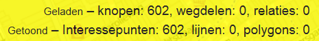
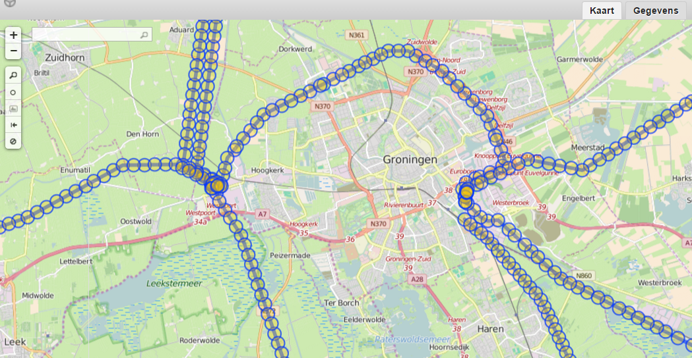

## Recurse down
Een way is een geordende lijst met nodes. Nodes hebben coördinaten, ways niet.  
Voer ter illustratie onderstaande zoekopdracht uit. De zoekopdracht vraagt aan Overpass API om alle [parken](http://wiki.openstreetmap.org/wiki/Tag:leisure%3Dpark) in de stad Groningen die als way zijn ingetekend.

```
area["name"="Groningen"]["admin_level"="10"]; 
way["leisure"="park"](area);
out;
```

Je krijgt de volgende melding:  
`This query returned no nodes. In OSM, only nodes contain coordinates. For example, a way cannot be displayed without its nodes.`  

Kies op de knop `Gegevens weergeven`.  

Het resultaat van de zoekopdracht wordt nu getoond in het tabblad _Gegevens_, want zonder coördinaten kan er immers niets op de kaart worden weergegeven. In onderstaand screenshot zie je dat een way slechts een lijst is met verwijzingen naar nodes. 

  

Met `out center;` vraag je voor iedere way het middelpunt van de bounding box op.

```
area["name"="Groningen"]["admin_level"="10"]; 
way["leisure"="park"](area);
out center;
```

Als je in het voorbeeld voor een way toch alle onderliggende nodes op wilt vragen, moet je gebruik maken van een _recurse down_. Hiervoor bestaat de `>` syntax.   

Check voordat je onderstaande code uitvoert de instellingen van Overpass Turbo. Het is voor de duidelijkheid namelijk handig wanneer je _Kleine objecten niet weergeven als POI_ hebt aangevinkt.  

 

```
area["name"="Groningen"]["admin_level"="10"];
(
  way["leisure"="park"](area);
  >;
); 
out;
```

 

De zoekopdracht retourneert alle ways die voldoen aan de filtercriteria plus alle onderliggende nodes. In het tabblad _Kaart_ kun je rechtsonder checken hoeveel en wat voor soort elementen de zoekopdracht terug geeft.  

 

Als je de ronde haken weg laat, krijg je alleen de onderliggende nodes retour.  

```
area["name"="Groningen"]["admin_level"="10"];
way["leisure"="park"](area);
>;
out;
```

Het aantal ways in het zoekresultaat is nu 0.  

   

Ways kunnen vlakken voorstellen, maar ook lijnen. Van deze lijnen kun je ook de onderliggende nodes opvragen, bijvoorbeeld van hoogspanningslijnen die door de stad Groningen lopen.

```
area["name"="Groningen"]["admin_level"="10"];
(
  way[power=line][voltage~"...000"](area);
  >;
);
out;
```

   

Merk op dat ook de delen van de way en onderliggende nodes die _buiten_ de stad Groningen liggen worden meegenomen in het zoekresultaat.

Recurse down werkt ook voor relations. Relations bevatten net als ways geen coördinaten, alleen verwijzingen. In onderstaand zoekopdracht worden de ways en nodes van de stadsgrens van Groningen opgevraagd.

```
relation[name="Groningen"]["admin_level"="10"];
>;
out;
```


Nog een voorbeeld waarbij van het [noordelijk deel van het Pieterpad](http://wiki.openstreetmap.org/wiki/WikiProject_Nederland_Wandelroutes#Lange-Afstand-Wandelpaden) de relation en onderliggende ways en nodes worden geretourneerd.

```
(
  relation["network"="nwn"]["ref"="LAW 9-1"];
  >;
);
out;
```

  

Oefening:  
Maak een zoekopdracht waarbij alle natuurijsbanen in Nederland als node, way of relation worden opgevraagd en als zodanig worden weergegeven in het tabblad _Kaart_.

## Recurse up
Overpass QL kent ook de _recurse up_ (```<```). Ter illustratie onderstaande zoekopdracht waarin voor node 621460846 alle ways en relations worden opgevraagd waar de node onderdeel van uitmaakt en alle relations waar de ways in het zoekresultaat onderdeel van uitmaken.
Node 621460846 is de bushalte voor de Martinitoren in Groningen.

```
node(621460846);
<; 
out geom;
```

Aan de `out` actie is de parameter `geom` toegevoegd. Deze parameter zorgt er voor dat aan elk element in het zoekresultaat geometrie wordt toegevoegd.  

[Volgende](6-settings.md)